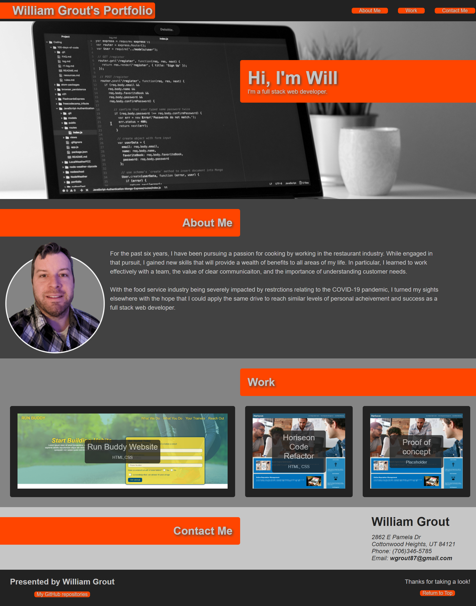
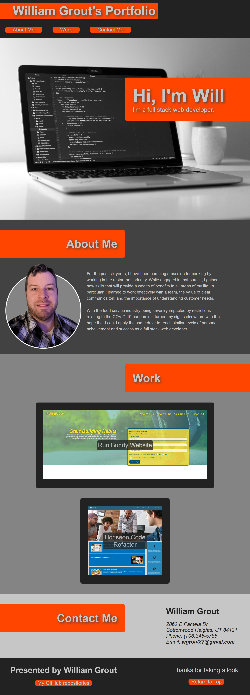

# William Grout - Personal Portfolio

## Description
This repository contains my personal portfolio. It is a website design that I have built from the ground up to showcase both myself and some of the projects I have worked on.The 'Work' section is styled such that the first project I ever coded has a larger card than any subsequent works that will be added. More projects will be added in the coming weeks.

Technologies used include HTML and CSS.

## Features
* Flexbox and media queries allow for responsive design that adopts to viewport
* Navigation buttons will direct viewers to each corresponding section
* CSS allows for simple addition of new cards into the 'Work' section by only modifying the HTML
* Clicking on the cards in the 'Work' section will redirect to those deployed projects

## Links

[Deployed website](https://wgrout87.github.io/Personal-Portfolio/)

[Code repository](https://github.com/wgrout87/Personal-Portfolio)

## Usage
This repository contains my personal portfolio, which can be viewed on a variety of devices as it has been configured for multiple screen dimensions. Information conveyed includes an about me section, detailing how I got into web design, a works section, which shows off some of the projects I've completed, and a contact section.

The deployed website should resemeble the following screenshots.

## Credits
The hero image used for the landing was created by Clément Hélardot and uploaded to https://unsplash.com/photos/95YRwf6CNw8. It is free to use under the Unsplash License.

The button design code came from a YouTube video posted by Skillthrive:
Skillthrive. (Dec 8, 2020.) 3 Awesome CSS Button Hover Effects Using HTML & CSS [Video file]. Retrieved by https://www.youtube.com/watch?v=iwoIuyRHy88&t=643s